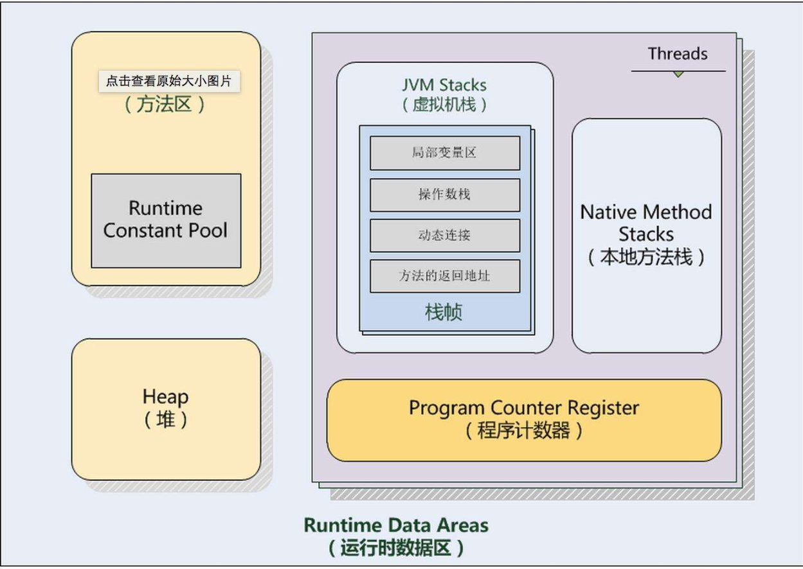
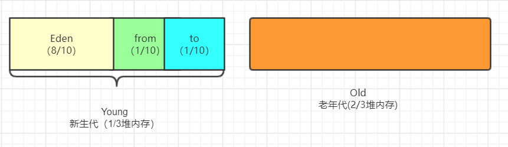
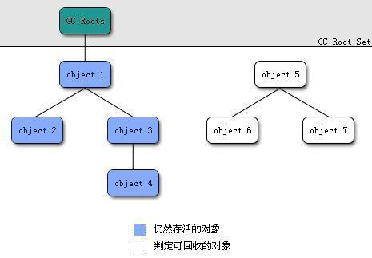
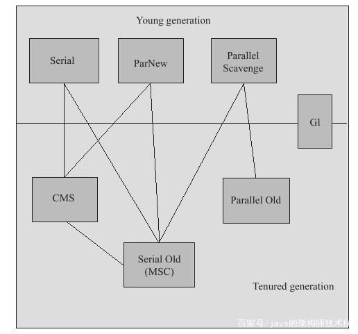
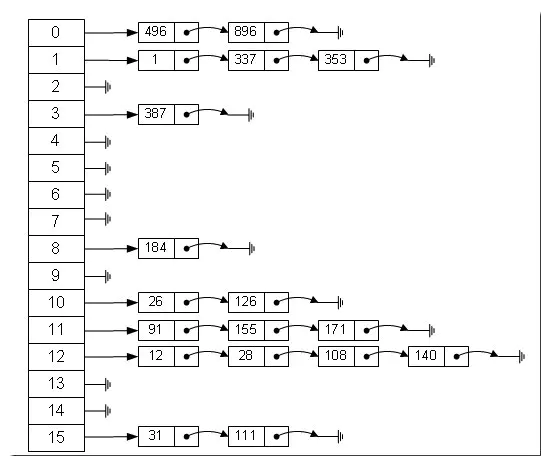
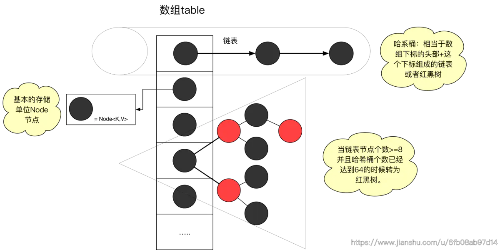
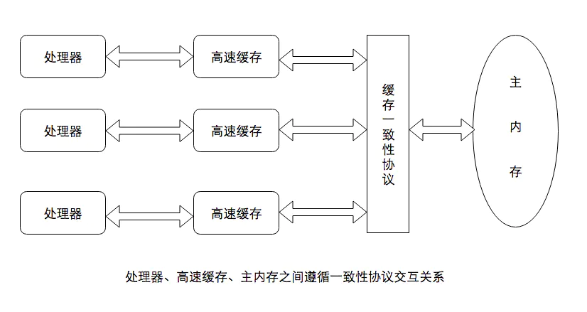
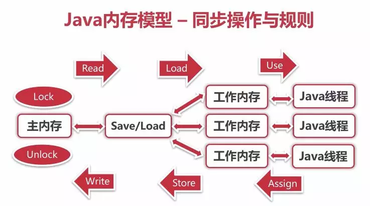

# JAVA基础部分

## JVM

### JVM的内存结构

​	JVM的内存结构一共分为5大内容，分别是**程序计数器**、**JAVA虚拟机栈**、**方法区**、**堆**、**本地方法栈**。 其关系如下图所示。




#### 程序计数器

​	程序计数器使用了一块较小的空间，主要是指向当前线程的所执行的字节码型号的指示器。字节码解释器工作就是通过改变这个计数器的值来选取下一条执行的字节码指令。程序分支、循环、跳转、异常处理都需要依赖与程序计数器。**此内存区域是唯一一个在java虚拟机规范中没有规定任何OutOfMemoryError情况的区域**

> 自我理解：程序计数器类似与一个管理员或者协调者，所有的事情都归他记录下来，下面的人执行什么由他来进行统一的调配和协调。这样就能让底下的人有条不紊的干活。

​	程序计数器是一个线程私有的内容。主要原因是CPU的切换不同的线程，在切换后需要知道上次执行的位置，所以每个线程必须私有化。

#### JAVA虚拟机栈

​	JAVA虚拟机栈是为了存储当前线程运行方法所需要的局部变量、指令、返回值、返回地址等信息。在每个方法执行的时候，虚拟机都会创建一个栈帧（Stack Frame）存储当前线程运行方法时所需要的数据、指令、返回地址。在每个方法执行时，虚拟机栈都会创建一个栈帧（Stack Frame），用于存储：局部变量表、操作数栈、动态链接、方法出口等信息。

​	局部变量表存放了编译器可知的各种基本数据类型（boolean、byte、char、short、int、float、long、double）、对象引用(reference类型，它不等同与对象本身，可能是一个指向对象其实地址的引用指针，也可能是指向一个代表对象的句柄或其他与此对象相关的位置) 和returnAddress类型（指向了一条字节码指令的地址）Java虚拟机

> 栈可能出现两种类型的异常：
>
> 1. 线程请求的栈深度大于虚拟机允许的栈深度，将抛出StackOverflowError。
> 2. 虚拟机栈空间可以动态扩展，当动态扩展无法申请到足够空间时，抛出OutOfMemory异常。

#### 本地方法栈

​	本地方法栈和JAVA虚拟机栈很相似，都叫栈，其区别有以下几点：

- java虚拟机栈为虚拟机执行java方法（也就是字节码）服务
- 本地方法栈为虚拟机使用到的Native方法服务

#### 方法区

​	方法区是用于区分堆的内容，也被称为非堆。用于存储已被虚拟机加载的类信息、常量、静态变量，如static修饰的变量加载类的时候就被加载到方法区中。

> 在老版jdk，方法区也被称为永久代【因为没有强制要求方法区必须实现垃圾回收，HotSpot虚拟机以永久代来实现方法区，从而JVM的垃圾收集器可以像管理堆区一样管理这部分区域，从而不需要专门为这部分设计垃圾回收机制。不过自从JDK7之后，Hotspot虚拟机便将运行时常量池从永久代移除了。】

``` java
jdk1.7开始逐步去永久代。从String.interns()方法可以看出来
String.interns()
native方法:作用是如果字符串常量池已经包含一个等于这个String对象的字符串，则返回代表池中的这个字符串的String对象，在jdk1.6及以前常量池分配在永久代中。可通过 -XX:PermSize和-XX:MaxPermSize限制方法区大小。
jdk8真正开始废弃永久代，而使用元空间(Metaspace)
```

```java
public class StringIntern {
    //运行如下代码探究运行时常量池的位置
    public static void main(String[] args) throws Throwable {
        //用list保持着引用 防止full gc回收常量池
        List<String> list = new ArrayList<String>();
        int i = 0;
        while(true){
            list.add(String.valueOf(i++).intern());
        }
    }
}
//如果在jdk1.6环境下运行 同时限制方法区大小 将报OOM后面跟着PermGen space说明方法区OOM，即常量池在永久代
//如果是jdk1.7或1.8环境下运行 同时限制堆的大小  将报heap space 即常量池在堆中
```

> 思考一下，为什么使用元空间替换永久代？
>
> 表面上看是为了避免OOM异常。因为通常使用`PermSize`和`MaxPermSize`设置永久代的大小就决定了永久代的上限，但是不是总能知道应该设置为多大合适, 如果使用默认值很容易遇到OOM错误。当使用元空间时，可以加载多少类的元数据就不再由`MaxPermSize`控制, 而由系统的实际可用空间来控制。更深层的原因还是要合并`HotSpot`和`JRockit`的代码，`JRockit`从来没有所谓的永久代，也不需要开发运维人员设置永久代的大小，但是运行良好。同时也不用担心运行性能问题了,在覆盖到的测试中, 程序启动和运行速度降低不超过1%，但是这点性能损失换来了更大的安全保障。

#### 堆



​	堆作为JVM中最大的一块内存。**java堆是被所有线程共享的一块内存区域**，堆的唯一目的就是存放实例对象，几乎所有的对象实例都在这里分配内存。它被划分为了两个不同区域：新生代(Young)、老年代(Old)。

> 注意：老年代不是永久代。之前我一直搞错，把老年代和永久代混为一谈，真正梳理之后才发现连基本概念都错了，上文提到了永久代是方法区的内容，而老年代是存放在堆中的信息。

​	新生代 ( Young ) 又被划分为三个区域：Eden、From Survivor、To Survivor。

> 为什么需要两个survivor区域？
>
> 首先要知道Survivor的存在意义
>
> **Survivor的存在意义，就是减少被送到老年代的对象，进而减少Full GC的发生，Survivor的预筛选保证，只有经历16次Minor GC还能在新生代中存活的对象，才会被送到老年代。**
>
> survivor区域是Eden区和Old区的一个过渡。对象首先在Eden区，YoungGC的时候，部分对象会被放在Servivor区，而servivor只会有一个区域被复制，这样可以减少碎片化，让servivor区会更快的复制到Old区。其基本流程是Eden和一个Servivor区回收到另一个Servivor区，然后再送到Old区。

​	java堆可以处于物理上不连续的内存空间中，只要逻辑上是连续的即可，就像我们磁盘空间一样。（不过在实现中既可以大小固定，也可以是可扩展，通过`-Xmx`和`-Xms`控制），**如果在堆中没有内存完成实例分配，并且堆也无法再扩展时**，将会抛出OutOfMemoryError异常。

###  垃圾回收机制

#### JVM视为“垃圾”的数据

​	之前看到了JVM的内存模型，我们看到程序计数器，JAVA方法栈和本地方法栈是在线程中的，随着线程的创建而创建，线程的销毁而销毁。这样的话，这些数据很可能就是朝生夕死。而且每个线程独有。这块内容就不是考虑的主要内容。真正要考虑的是公用部分，是堆和非堆(也就是方法区)。这部分的内容是大家共享的，但是用完了并不会告知要进行清理，这个时候就需要垃圾回收机制来保证他们的清理工作。

#### 垃圾判断算法

##### 引用计数法

​	引用计数法就是给对象中添加一个引用计数器，每当有一个地方引用它，计数器就加 1；当引用失效，计数器就减 1；任何时候计数器为 0 的对象就是不可能再被使用的，可以当做垃圾收集。这种方法实现起来很简单而且优缺点都很明显。

- **优点 执行效率高，程序执行受影响较小**
- **缺点 无法检测出循环引用的情况，导致内存泄露**

##### 可达性分析算法

​	可达性分析基本思路是把所有引用的对象想象成一棵树，从树的根结点 GC Roots 出发，持续遍历找出所有连接的树枝对象，这些对象则被称为“可达”对象，或称“存活”对象。不能到达的则被可回收对象。

下面这张图就是可达性分析的描述：



#### 垃圾回收算法

##### 标记－清理

​	第一步（标记），利用可达性遍历内存，把“存活”对象和“垃圾”对象进行标记。

​	第二步（清理），我们再遍历一遍，把所有“垃圾”对象所占的空间直接 清空 即可。

​	特点为：

- 简单方便
- 容易产生内存碎片

##### 标记－整理

​	第一步（标记）：利用可达性遍历内存，把“存活”对象和“垃圾”对象进行标记。

​	第二步（整理）：把所有存活对象堆到同一个地方，这样就没有内存碎片了。

​	特点为：

- 适合存活对象多，垃圾少的情况
- 需要整理的过程

##### 复制

​	将内存按照容量划分为大小相等的两块，每次只使用其中的一块。当这一块用完了，就将还活着的对象复制到另一块上，然后再把使用过的内存空间一次性清理掉。

​	特点为：

- 只能使用一半的空间
- 简单
- 不会产生碎片

#### 方法区的垃圾回收

​	方法区又叫做永久代。永久代的垃圾回收主要有两部分：废弃常量和无用的类。

​	首先是废弃常量垃圾回收的一般步骤：

​	第一步：判定一个常量是否是废弃常量：没有任何一个地方对这个常量进行引用就表示是废弃常量。

​	第二步：垃圾回收

​	然后是无用的类垃圾回收的一般步骤：判定一个类是否是“无用的类”：需要满足下面三个条件:

1. 该类所有的实例都已经被回收,也就是Java堆中不存在该类的任何实例。
2. 加载该类的ClassLoader已经被回收。
3. 该类对应的java.lang.Class对象没有在任何地方被引用,无法在任何地方通过反射访问该类的方法。

#### 堆的垃圾回收

​	因为堆被划分成了Young区和Old区，所以堆的垃圾回收也是分代进行回收的。Young区的特点是：存活对象少，垃圾多。而Old区正好相反：存活对象多，垃圾少。所以对这两个需要单独讨论

##### Young区的回收

​	Young区采用的`复制回收`算法，GC 时把少量的存活对象复制过去即可。但是从上面我们可以看到，新生代也划分了三个部分比例：Eden：S1：S2=8:1:1。

​	工作原理如下：

1. 首先，Eden对外提供堆内存。当 Eden区快要满了，触发垃圾回收机制，把存活对象放入 Survivor A 区，清空 Eden 区；
2. Eden区被清空后，继续对外提供堆内存；
3. 当 Eden 区再次被填满，对 Eden区和 Survivor A 区同时进行垃圾回收，把存活对象放入 Survivor B区，同时清空 Eden 区和Survivor A 区；
4. 当某个 Survivor区被填满，把多余对象放到Old 区；
5. 当 Old 区也被填满时，进行 下一阶段的垃圾回收。

##### Old区的回收

​	根据老年代的特点，这里仅仅通过少量地移动对象就能清理垃圾，而且不存在内存碎片化。也就是标记整理的回收机制。所以Old区采用的是`标记-整理`算法。

### 垃圾回收器

​	如果说收集算法是内存回收的方法论，那么垃圾收集器就是内存回收的具体实现。在了解垃圾回收器之前，首先得了解一下垃圾回收器的几个名词。

1. 吞吐量

   CPU用于运行用户代码的时间与CPU总消耗时间的比值。比如说虚拟机总运行了100 分钟，用户代码时间 99 分钟，垃圾回收时间1分钟，那么吞吐量就是99%。

2. 停顿时间

   停顿时间指垃圾回收器正在运行时，应用程序的暂停时间。

3. GC的名词

   新生代GC：Minor GC

   老年代GC：Major GC

4. 并发与并行

   1. 串行（Parallel）

      垃圾回收线程 进行垃圾回收工作，但此时 用户线程仍然处于等待状态。

   2. 并发（Concurrent）

      这里的并发指 用户线程 与 垃圾回收线程 交替执行。

   3. 并行（Parallel）

      这里的并行指 用户线程 和多条 垃圾回收线程 分别在不同 CPU 上同时工作。
      
#### Serial

​	最基本、发展最久的收集器，在jdk3以前是gc收集器的唯一选择。采用的是`复制算法`。垃圾清理时，Serial收集器只能使用一条线程进行收集工作，在收集的时候必须得停掉其它线程，等待收集工作完成其它线程才可以继续工作。所以Serial回收器不存在线程间的切换，因此，在单CPU的环境下，垃圾清除效率比较高。

> ​	优点：对于Client模式下的jvm来说是个好的选择。适用于单核CPU【现在基本都是多核了】
> ​	缺点：收集时要暂停其它线程，有点浪费资源，多核下显得。

#### ParNew

   ParNew回收器是在Serial回收器的基础上演化而来的，属于Serial回收器的多线程版本，采用`复制算法`。运行在新生代区域。在实现上，两者共用很多代码。在不同运行环境下，根据CPU核数，开启不同的线程数，从而达到最优的垃圾回收效果。

> 优点:
> 1.支持多线程，多核CPU下可以充分的利用CPU资源
> 2.运行在Server模式下新生代首选的收集器【重点是因为新生代的这几个收集器只有它和Serial可以配合CMS收集器一起使用】
>
> 缺点: 在单核下表现不会比Serial好，由于在单核能利用多核的优势，在线程收集过程中可能会出现频繁上下文切换，导致额外的开销。

#### Parallel Scavenge

​	采用`复制算法`的收集器，和ParNew一样支持多线程。

​	但是该收集器重点关心的是吞吐量【吞吐量 = 代码运行时间 / (代码运行时间 + 垃圾收集时间)  如果代码运行100min垃圾收集1min，则为99%】对于用户界面，适合使用GC停顿时间短,不然因为卡顿导致交互界面卡顿将很影响用户体验。

​	对于后台

​	高吞吐量可以高效率的利用cpu尽快完成程序运算任务，适合后台运算

> Parallel Scavenge注重吞吐量，所以也成为"吞吐量优先"收集器。

#### Serial Old

​	和新生代的Serial一样为单线程，Serial的老年代版本，不过它采用"标记-整理算法"，这个模式主要是给Client模式下的JVM使用。如果是Server模式有两大用途

1. jdk5前和Parallel Scavenge搭配使用，jdk5前也只有这个老年代收集器可以和它搭配。

2. 作为CMS收集器的后备。

#### Parallel Old

   支持多线程，Parallel Scavenge的老年版本，jdk6开始出现， 采用"标记-整理算法"【老年代的收集器大都采用此算法】

   在jdk6以前，新生代的Parallel Scavenge只能和Serial Old配合使用【根据图，没有这个的话只剩Serial Old，而Parallel Scavenge又不能和CMS配合使用】，而且Serial Old为单线程Server模式下会拖后腿【多核cpu下无法充分利用】，这种结合并不能让应用的吞吐量最大化。

> Parallel Old的出现结合Parallel Scavenge，真正的形成“吞吐量优先”的收集器组合。
>

#### CMS

​	CMS收集器(Concurrent Mark Sweep)是以一种获取最短回收停顿时间为目标的收集器。【重视响应，可以带来好的用户体验，被sun称为并发低停顿收集器】。CMS采用的是"标记-清除"(Mark Sweep)算法，而且是支持并发(Concurrent)的

​	它的运作分为4个阶段

> 1.初始标记:标记一下GC Roots能直接关联到的对象，速度很快
> 2.并发标记:GC Roots Tarcing过程，即可达性分析
> 3.重新标记:为了修正因并发标记期间用户程序运作而产生变动的那一部分对象的标记记录，会有些许停顿，时间上一般 初始  标记 < 重新标记 < 并发标记
> 4.并发清除

​	以上初始标记和重新标记需要stw(停掉其它运行java线程)，之所以说CMS的用户体验好，是因为CMS收集器的内存回收工作是可以和用户线程一起并发执行。

​	总体上CMS是款优秀的收集器，但是它也有些缺点。

> 1.cms堆cpu特别敏感，cms运行线程和应用程序并发执行需要多核cpu，如果cpu核数多的话可以发挥它并发执行的优势，但是cms默认配置启动的时候垃圾线程数为 (cpu数量+3)/4，它的性能很容易受cpu核数影响，当cpu的数目少的时候比如说为为2核，如果这个时候cpu运算压力比较大，还要分一半给cms运作，这可能会很大程度的影响到计算机性能。
>
> 2.cms无法处理浮动垃圾，可能导致Concurrent Mode Failure（并发模式故障）而触发full GC
>
> 3.由于cms是采用"标记-清除“算法,因此就会存在垃圾碎片的问题，为了解决这个问题cms提供了 **-XX:+UseCMSCompactAtFullCollection**选项，这个选项相当于一个开关【默认开启】，用于CMS顶不住要进行full GC时开启内存碎片合并，内存整理的过程是无法并发的，且开启这个选项会影响性能(比如停顿时间变长)

#### G1收集器

​	G1(garbage first:尽可能多收垃圾，避免full gc)收集器是当前最为前沿的收集器之一(1.7以后才开始有)，同cms一样也是关注降低延迟，是用于替代cms功能更为强大的新型收集器，因为它解决了cms产生空间碎片等一系列缺陷。适用于 Java HotSpot VM 的低暂停、服务器风格的分代式垃圾回收器。G1 GC 使用并发和并行阶段实现其目标暂停时间，并保持良好的吞吐量。当 G1 GC 确定有必要进行垃圾回收时，它会先收集存活数据最少的区域（垃圾优先)，g1的特别之处在于它强化了分区，弱化了分代的概念，是区域化、增量式的收集器，它不属于新生代也不属于老年代收集器。用到的算法为标记-清理、复制算法。

​	g1通过并发(并行)标记阶段查找老年代存活对象，通过并行复制压缩存活对象【这样可以省出连续空间供大对象使用】。g1将一组或多组区域中存活对象以增量并行的方式复制到不同区域进行压缩，从而减少堆碎片，目标是尽可能多回收堆空间【垃圾优先】，且尽可能不超出暂停目标以达到低延迟的目的。g1提供三种垃圾回收模式 young gc、mixed gc 和 full gc,不像其它的收集器，根据区域而不是分代，新生代老年代的对象它都能回收。

下面其中垃圾回收器是基于HotSpot虚拟机。



## JAVA 集合

​	java集合是我们经常需要用到一个辅助工具，深入的了解集合以及集合的用法可以更快的帮助我们编写程序，编写效率更高，性能更好的程序。深入的理解JAVA集合是很有必要的一件事情。

> 数组和集合的比较
>
> ​	数组不是面向对象的，存在明显的缺陷，集合弥补了数组的缺点，比数组更灵活更实用，而且不同的集合框架类可适用不同场合。如下：
>
> 1. 数组能存放基本数据类型和对象，而集合类存放的都是对象，集合类不能存放基本数据类型。数组和集合存放的对象皆为对象的引用地址。
> 2. 数组容易固定无法动态改变，集合类容量动态改变。
> 3. 数组无法判断其中实际存有多少元素，length只告诉了数组的容量，而集合的size()可以确切知道元素的个数
> 4. 集合有多种实现方式和不同适用场合，不像数组仅采用顺序表方式
> 5. 集合以类的形式存在，具有封装、继承、多态等类的特性，通过简单的方法和属性即可实现各种复杂操作，大大提高了软件的开发效率

​	JAVA的集合框架由两大家族组成。分别是**Collection**家族和**Map**家族。下图展示了集合的框架结构。

​	

### Collection

​	Java标准库自带的`java.util`包提供了集合类：`Collection`，它是除`Map`外所有其他集合类的根接口。Java的`java.util`包主要提供了以下三种类型的集合：

- `List`：一种排列有序、可以重发的的集合；
- `Set`：一种无序，但保证没有重复元素的集合；
- `Queue`：一种先进先出、排列有序的，可以重复的队列集合。

```java
public interface Collection<E> extends Iterable<E> {
    //获取集合中的数量，如果超过了Integer.MAX_VALUE，则返回Integer.MAX_VALUE
    int size();
	//集合为空则返回true
    boolean isEmpty();
	//判断集合是否包含了元素，包含返回true
    boolean contains(Object var1);
	//返回一个迭代器
    Iterator<E> iterator();
	//返回一个顺序性对象数组
    Object[] toArray();
	//返回一个指定类型的数组
    <T> T[] toArray(T[] var1);
	//在List结尾添加一个元素
    boolean add(E var1);
	//移除第一个匹配的元素
    boolean remove(Object var1);
	//判断是否包含了集合内的全部元素
    boolean containsAll(Collection<?> var1);
	//添加集合内所有元素
    boolean addAll(Collection<? extends E> var1);
	//移除参数中集合内的匹配到的所有元素
    boolean removeAll(Collection<?> var1);
	//Lambda表达式的过滤器，匹配到了过滤器则移除
    default boolean removeIf(Predicate<? super E> var1) {
        Objects.requireNonNull(var1);
        boolean var2 = false;
        Iterator var3 = this.iterator();

        while(var3.hasNext()) {
            if (var1.test(var3.next())) {
                var3.remove();
                var2 = true;
            }
        }

        return var2;
    }
	//只保留匹配到参数中的集合元素
    boolean retainAll(Collection<?> var1);
	//清空集合
    void clear();
	//equals方法
    boolean equals(Object var1);
	//hashCode方法
    int hashCode();
	//返回分割器
    default Spliterator<E> spliterator() {
        return Spliterators.spliterator(this, 0);
    }
	//返回流，配合分割器做迭代用
    default Stream<E> stream() {
        return StreamSupport.stream(this.spliterator(), false);
    }
	//返回并发流，配合分割器做迭代用
    default Stream<E> parallelStream() {
        return StreamSupport.stream(this.spliterator(), true);
    }
}

```


#### List

​	List集合为列表类型，以线性方式存储对象。List集合中的元素允许重复，各元素的顺序就是对象插入的顺序。用户可以通过使用**索引**来访问List集合中的元素。**List集合的特点就是存取有序，可以存储重复的元素，可以用下标进行元素的操作。**

​	List中几个重要的方法

| 方法                                      | 说明                                                         |
| ----------------------------------------- | ------------------------------------------------------------ |
| void add（int index，Object obj）         | 将obj插入调用列表，插入位置的下标由index传递。任何已存在的，在插入点以及插入点以后的元素将前移，因此没有元素被覆写。 |
| Boolean addAll（int index，Collection c） | 将c中的所有元素插入到调用列表中，插入点的下标由index传递。   |
| Object get（int index）                   | 返回指定下标的对象                                           |
| Object set（int index，Object obj）       | 对由index指定的位置进行赋值                                  |
| int indexOf（Object obj）                 | 返回调用列表obj的第一个实例的下标。如果obj不是列表元素，返回-1. |

##### ArrayList

​	ArrayList支持可随需要而增长的动态数组。在Java数组中，长度是固定的，因此在数组被创建后，不能修改长度，这意味着开发者需要实现知道数组的长度。但在一般情况下，只有在运行时才知道数组长度。为了解决这个问题，ArrayList因此而生。下面分析以下ArrayList的几个重点方法。

1. 构造方法

```java 
//继承了AbstractList，实现了List接口，RandomAccess随机访问接口，Cloneable接口，序列化接口
public class ArrayList<E> extends AbstractList<E>
        implements List<E>, RandomAccess, Cloneable, java.io.Serializable{
    //指定大小构造一个ArrayList的内部数组
    public ArrayList(int var1) {
        if (var1 > 0) {
            this.elementData = new Object[var1];
        } else {
            if (var1 != 0) {
                throw new IllegalArgumentException("Illegal Capacity: " + var1);
            }
            this.elementData = EMPTY_ELEMENTDATA;
        }
    }
    //按照默认容量来构造一个数组，默认大小为10
    public ArrayList() {
        this.elementData = DEFAULTCAPACITY_EMPTY_ELEMENTDATA;
    }
    //根据集合来构造一个ArrayList数组
    public ArrayList(Collection<? extends E> var1) {
        this.elementData = var1.toArray();
        if ((this.size = this.elementData.length) != 0) {
            if (this.elementData.getClass() != Object[].class) {
                this.elementData = Arrays.copyOf(this.elementData, this.size, Object[].class);
            }
        } else {
            //集合元素为空则创建默认容量为10的数组
            this.elementData = EMPTY_ELEMENTDATA;
        }
    }
｝
```

2. 新增操作

```java
//新增一个元素
public boolean add(E var1) {
    this.ensureCapacityInternal(this.size + 1);
    this.elementData[this.size++] = var1;
    return true;
}
//在指定位置新增
public void add(int var1, E var2) {
    this.rangeCheckForAdd(var1);
    this.ensureCapacityInternal(this.size + 1);
    System.arraycopy(this.elementData, var1, this.elementData, var1 + 1, this.size - var1);
    this.elementData[var1] = var2;
    ++this.size;
}
//确保容量，不够需要扩容
private void ensureCapacityInternal(int var1) {
    this.ensureExplicitCapacity(calculateCapacity(this.elementData, var1));
}
//确保容量，不够需要扩容
private void ensureExplicitCapacity(int var1) {
    //修改次数+1
    ++this.modCount;
    if (var1 - this.elementData.length > 0) {
        this.grow(var1);
    }
}
//扩容函数
private void grow(int var1) {
    int var2 = this.elementData.length;
    //默认扩容原容量的一半
    int var3 = var2 + (var2 >> 1);
    if (var3 - var1 < 0) {
        var3 = var1;
    }
    if (var3 - 2147483639 > 0) {
        var3 = hugeCapacity(var1);
    }
    this.elementData = Arrays.copyOf(this.elementData, var3);
}
```

```java
/**
 *
 * @param  src      the source array. 来源数组
 * @param  srcPos   starting position in the source array. 从来源数组开始拷贝的位置
 * @param  dest     the destination array.	目标数组
 * @param  destPos  starting position in the destination data.	目标数组开始的位置
 * @param  length   the number of array elements to be copied. 需要拷贝的来源的位置
 */
public static native void arraycopy(Object src,  int  srcPos, Object dest, int destPos, int length);
```

> copy数组可以使用`System.arraycopy`和`Arrays.copyOf`方法，`System.arraycopy`是`native`方法，而`Arrays`是一个工具类，在调用`copyOf`的时候，实际也还是调用了`System.arraycopy`，只是包装了一下，使用起来更加的简单和方便。

3. 删除操作
```java 
public E remove(int index) {
    rangeCheck(index);
    modCount++;
    //获取需要移除的元素
    E oldValue = elementData(index);
    int numMoved = size - index - 1;
    if (numMoved > 0)
        System.arraycopy(elementData, index+1, elementData, index,
                         numMoved);
    elementData[--size] = null; // clear to let GC do its work
    return oldValue;
}
public boolean remove(Object o) {
    if (o == null) {
        for (int index = 0; index < size; index++)
            if (elementData[index] == null) {
                fastRemove(index);
                return true;
            }
    } else {
        for (int index = 0; index < size; index++)
            if (o.equals(elementData[index])) {
                fastRemove(index);
                return true;
            }
    }
    return false;
}
private void fastRemove(int index) {
    modCount++;
    int numMoved = size - index - 1;
    if (numMoved > 0)
        System.arraycopy(elementData, index+1, elementData, index,
                         numMoved);
    elementData[--size] = null; // clear to let GC do its work
}
```

4. 更改操作

```java
public E set(int index, E element) {
    rangeCheck(index);
	//获取旧的值
    E oldValue = elementData(index);
    //赋值新值
    elementData[index] = element;
    return oldValue;
}
//校验长度范围
private void rangeCheck(int index) {
    if (index >= size)
        throw new IndexOutOfBoundsException(outOfBoundsMsg(index));
}
```

5. 查找操作

```java
public E get(int index) {
    rangeCheck(index);
    //直接返回位置的元素
    return elementData(index);
}
```

6. 总结

- ArrayList自己实现了序列化和反序列化的方法
- ArrayList基于数组方式实现，无容量的限制（会扩容）。添加元素时可能要扩容（所以最好预判一下），删除元素时不会减少容量（若希望减少容量，trimToSize()），删除元素时，将删除掉的位置元素置为null，下次gc就会回收这些元素所占的内存空间。
- 线程不安全，会出现fall-fail。
- add(int index, E element)：添加元素到数组中指定位置的时候，需要将该位置及其后边所有的元素都整块向后复制一位
- get(int index)：获取指定位置上的元素时，可以通过索引直接获取（O(1)）
- remove(Object o)需要遍历数组
- remove(int index)不需要遍历数组，只需判断index是否符合条件即可，效率比remove(Object o)高
- contains(E)需要遍历数组
- 使用iterator遍历可能会引发多线程异常

##### LinkedList

​	LinkedList基于链表实现的，从源码可以看出是一个双向链表。双向链表适用于增删频繁且查询不频繁的场景，线程不安全的且适用于单线程（这点和ArrayList很像）。直接父类是AbstractSequentialList，不实现RandomAccess接口，不支持随机访问。AbstractSequentialList这个抽象类实现了最基本的顺序访问功能，虽然支持随机访问的也支持顺序访问，但是一般设计上还是会把它们两个当成无关联的两个特性。所以当利用随机访问特性时优先extends AbstractList而不是此类，当然实现此类也可以，只是没必要。

1. 构造方法

```java
//特别注意这个继承的是AbstractSequentialList，它没有实现RandomAccess接口
public class LinkedList<E>
    extends AbstractSequentialList<E>
    implements List<E>, Deque<E>, Cloneable, java.io.Serializable {
	
    public LinkedList() {
    }

    //根据集合构造
    public LinkedList(Collection<? extends E> c) {
        this();
        addAll(c);
    }
｝
```

2. 新增操作

```java
//默认在最尾端新增一个Node节点，即添加元素
public boolean add(E e) {
    linkLast(e);
    return true;
}
void linkLast(E e) {
    final Node<E> l = last;
    final Node<E> newNode = new Node<>(l, e, null);
    last = newNode;
    if (l == null)
        first = newNode;
    else
        l.next = newNode;
    size++;
    modCount++;
}
```

3. 删除操作

```java
public E remove(int index) {
    checkElementIndex(index);
    return unlink(node(index));
}
private void checkElementIndex(int index) {
    if (!isElementIndex(index))
        throw new IndexOutOfBoundsException(outOfBoundsMsg(index));
}
//解掉关联信息，名字也可以看出来，unlink
E unlink(Node<E> x) {
    // assert x != null;
    final E element = x.item;
    final Node<E> next = x.next;
    final Node<E> prev = x.prev;

    if (prev == null) {
        first = next;
    } else {
        prev.next = next;
        x.prev = null;
    }

    if (next == null) {
        last = prev;
    } else {
        next.prev = prev;
        x.next = null;
    }

    x.item = null;
    size--;
    modCount++;
    return element;
}
```

4. 更改操作

```java
public E set(int index, E element) {
    checkElementIndex(index);
    Node<E> x = node(index);
    E oldVal = x.item;
    x.item = element;
    return oldVal;
}
```

5. 查找操作

```java
public E get(int index) {
    checkElementIndex(index);
    return node(index).item;
}
//2分法进行查找
Node<E> node(int index) {
    // assert isElementIndex(index);
    if (index < (size >> 1)) {
        Node<E> x = first;
        for (int i = 0; i < index; i++)
            x = x.next;
        return x;
    } else {
        Node<E> x = last;
        for (int i = size - 1; i > index; i--)
            x = x.prev;
        return x;
    }
}
```

6. 总结

- LinkedList 是双向列表，链表批量增加，是靠for循环遍历原数组，依次执行插入节点操作。
- ArrayList基于数组， LinkedList基于双向链表，对于随机访问， ArrayList比较占优势，但LinkedList插入、删除元素比较快，因为只要调整指针的指向。针对特定位置需要遍历时，所以LinkedList在随机访问元素的话比较慢。
- LinkedList没有实现自己的 Iterator，使用的是 ListIterator。
- LinkedList需要更多的内存，因为 ArrayList的每个索引的位置是实际的数据，而 LinkedList中的每个节点中存储的是实际的数据和前后节点的位置。
- LinkedList也是非线程安全的，只有在单线程下才可以使用。为了防止非同步访问，Collections类里面提供了synchronizedList()方法。

#####  Vector

​	Vector 是**矢量队列**，它是JDK1.0版本添加的类。继承于AbstractList，实现了List, RandomAccess, Cloneable这些接口。

​	Vector 继承了AbstractList，实现了List；所以，**它是一个队列，支持相关的添加、删除、修改、遍历等功能**。

​	Vector 实现了RandmoAccess接口，即**提供了随机访问功能**。RandmoAccess是java中用来被List实现，为List提供快速访问功能的。在Vector中，我们即可以通过元素的序号快速获取元素对象；这就是快速随机访问。

​	Vector 实现了Cloneable接口，即实现clone()函数。它能被克隆。

​	和ArrayList不同，**Vector中的操作是线程安全的**。  

​	总结：和ArrayList差不多，但是它是线程安全的。

#### Set

​	Set:注重独一无二的性质,该体系集合可以知道某物是否已近存在于集合中,不会存储重复的元素用于存储无序(存入和取出的顺序不一定相同)元素，值不能重复。

对象的相等性

​	引用到堆上同一个对象的两个引用是相等的。如果对两个引用调用hashCode方法，会得到相同的结果，如果对象所属的类没有覆盖Object的hashCode方法的话，hashCode会返回每个对象特有的序号（java是依据对象的内存地址计算出的此序号），所以两个不同的对象的hashCode值是不可能相等的。如果想要让两个不同的Person对象视为相等的，就必须覆盖Object继下来的hashCode方法和equals方法，因为Object hashCode方法返回的是该对象的内存地址，所以必须重写hashCode方法，才能保证两个不同的对象具有相同的hashCode，同时也需要两个不同对象比较equals方法会返回true

​	该集合中没有特有的方法，直接继承自Collection。

​	其源码为包含了一个`HashMap`,下文会对`HashMap`进行分析，这里不作更多解释。

### Map

​	Map与List和Set接口不同，它是由键值对组成的集合，提供了Key-value的映射，同时他不继承Collection，保证key-value的一一对应，他不存在相同的key值，但是value值可以相同。

```java
package java.util;

import java.io.Serializable;
import java.util.function.BiConsumer;
import java.util.function.BiFunction;
import java.util.function.Function;

public interface Map<K, V> {
    //返回key-value对的数量，如果超过了Integer.MAX_VALUE则返回Integer.MAX_VALUE
    int size();
	//判断Map是否为空，为空返回true
    boolean isEmpty();
	//判断是否包含了key值
    boolean containsKey(Object var1);
	//判断是否包含了value值
    boolean containsValue(Object var1);
	//通过key获取value值
    V get(Object var1);
	//放入key-value对，如果key是存在的，返回之前老的值，否则返回空
    V put(K var1, V var2);
	//根据key移除key-value对，如果key是存在的，返回之前老的值，否则返回空
    V remove(Object var1);
	//批量插入集合
    void putAll(Map<? extends K, ? extends V> var1);
	//清理集合
    void clear();
	//返回key的集合，因为key是不能重复的，所以采用的是Set
    Set<K> keySet();
	//返回value的集合
    Collection<V> values();
	//返回key-value键值对集合
    Set<Map.Entry<K, V>> entrySet();
	//equals方法
    boolean equals(Object var1);
	//hashCode方法
    int hashCode();
	//获取key的值，如果没有，返回传入的value值
    default V getOrDefault(Object var1, V var2) {
        Object var3;
        return (var3 = this.get(var1)) == null && !this.containsKey(var1) ? var2 : var3;
    }
	//根据Lambda表达式的循环处理
    default void forEach(BiConsumer<? super K, ? super V> var1) {
        Objects.requireNonNull(var1);

        Object var4;
        Object var5;
        for(Iterator var2 = this.entrySet().iterator(); var2.hasNext(); var1.accept(var4, var5)) {
            Map.Entry var3 = (Map.Entry)var2.next();

            try {
                var4 = var3.getKey();
                var5 = var3.getValue();
            } catch (IllegalStateException var7) {
                throw new ConcurrentModificationException(var7);
            }
        }

    }
	//根据Lambda表达式的replaceAll
    default void replaceAll(BiFunction<? super K, ? super V, ? extends V> var1) {
        Objects.requireNonNull(var1);
        Iterator var2 = this.entrySet().iterator();

        while(var2.hasNext()) {
            Map.Entry var3 = (Map.Entry)var2.next();

            Object var4;
            Object var5;
            try {
                var4 = var3.getKey();
                var5 = var3.getValue();
            } catch (IllegalStateException var8) {
                throw new ConcurrentModificationException(var8);
            }

            var5 = var1.apply(var4, var5);

            try {
                var3.setValue(var5);
            } catch (IllegalStateException var7) {
                throw new ConcurrentModificationException(var7);
            }
        }

    }
	//如果key不存在则put,否则就返回以前的值
    default V putIfAbsent(K var1, V var2) {
        Object var3 = this.get(var1);
        if (var3 == null) {
            var3 = this.put(var1, var2);
        }
        return var3;
    }
	//revome指定的key-value的值
    default boolean remove(Object var1, Object var2) {
        Object var3 = this.get(var1);
        if (Objects.equals(var3, var2) && (var3 != null || this.containsKey(var1))) {
            this.remove(var1);
            return true;
        } else {
            return false;
        }
    }
	//如果key-var2存在，则将var2替换var3
    default boolean replace(K var1, V var2, V var3) {
        Object var4 = this.get(var1);
        if (Objects.equals(var4, var2) && (var4 != null || this.containsKey(var1))) {
            this.put(var1, var3);
            return true;
        } else {
            return false;
        }
    }
	//如果key，则把替换成var2的值
    default V replace(K var1, V var2) {
        Object var3;
        if ((var3 = this.get(var1)) != null || this.containsKey(var1)) {
            var3 = this.put(var1, var2);
        }

        return var3;
    }

    default V computeIfAbsent(K var1, Function<? super K, ? extends V> var2) {
        Objects.requireNonNull(var2);
        Object var3;
        Object var4;
        if ((var3 = this.get(var1)) == null && (var4 = var2.apply(var1)) != null) {
            this.put(var1, var4);
            return var4;
        } else {
            return var3;
        }
    }
	
    default V computeIfPresent(K var1, BiFunction<? super K, ? super V, ? extends V> var2) {
        Objects.requireNonNull(var2);
        Object var3;
        if ((var3 = this.get(var1)) != null) {
            Object var4 = var2.apply(var1, var3);
            if (var4 != null) {
                this.put(var1, var4);
                return var4;
            } else {
                this.remove(var1);
                return null;
            }
        } else {
            return null;
        }
    }

    default V compute(K var1, BiFunction<? super K, ? super V, ? extends V> var2) {
        Objects.requireNonNull(var2);
        Object var3 = this.get(var1);
        Object var4 = var2.apply(var1, var3);
        if (var4 == null) {
            if (var3 == null && !this.containsKey(var1)) {
                return null;
            } else {
                this.remove(var1);
                return null;
            }
        } else {
            this.put(var1, var4);
            return var4;
        }
    }

    default V merge(K var1, V var2, BiFunction<? super V, ? super V, ? extends V> var3) {
        Objects.requireNonNull(var3);
        Objects.requireNonNull(var2);
        Object var4 = this.get(var1);
        Object var5 = var4 == null ? var2 : var3.apply(var4, var2);
        if (var5 == null) {
            this.remove(var1);
        } else {
            this.put(var1, var5);
        }

        return var5;
    }

    public interface Entry<K, V> {
        K getKey();

        V getValue();

        V setValue(V var1);

        boolean equals(Object var1);

        int hashCode();

        static <K extends Comparable<? super K>, V> Comparator<Map.Entry<K, V>> comparingByKey() {
            return (Comparator)((Serializable)((var0x, var1x) -> {
                return ((Comparable)var0x.getKey()).compareTo(var1x.getKey());
            }));
        }

        static <K, V extends Comparable<? super V>> Comparator<Map.Entry<K, V>> comparingByValue() {
            return (Comparator)((Serializable)((var0x, var1x) -> {
                return ((Comparable)var0x.getValue()).compareTo(var1x.getValue());
            }));
        }

        static <K, V> Comparator<Map.Entry<K, V>> comparingByKey(Comparator<? super K> var0) {
            Objects.requireNonNull(var0);
            return (Comparator)((Serializable)((var1x, var2x) -> {
                return var0.compare(var1x.getKey(), var2x.getKey());
            }));
        }

        static <K, V> Comparator<Map.Entry<K, V>> comparingByValue(Comparator<? super V> var0) {
            Objects.requireNonNull(var0);
            return (Comparator)((Serializable)((var1x, var2x) -> {
                return var0.compare(var1x.getValue(), var2x.getValue());
            }));
        }
    }
}
```

#### HashMap

​	HashMap就是一个散列表，是基于哈希表的Map接口实现，它存储的内容是键值对 (key-value) 映射，并且键值允许为null(键的话只允许一个为null)。因为JDK1.7和JDK1.8的HashMap有很大的不同，所以现在对1.7和1.8分开介绍。

##### 1.7版本的HashMap

​	1.7版本的HashMap是数组+链表的形式，也就是所谓的"拉链法"。如下图所示。



​	下面对几个重点内容进行分析

1. 构造函数

```java
// 1. 容量（capacity）： HashMap中数组的长度
// a. 容量范围：必须是2的幂 & <最大容量（2的30次方）
// b. 初始容量 = 哈希表创建时的容量
// 默认容量 = 16 = 1<<4 = 00001中的1向左移4位 = 10000 = 十进制的2^4=16
static final int DEFAULT_INITIAL_CAPACITY = 1 << 4;
// 最大容量 =  2的30次方（若传入的容量过大，将被最大值替换）
static final int MAXIMUM_CAPACITY = 1 << 30;

// 2. 加载因子(Load factor)：HashMap在其容量自动增加前可达到多满的一种尺度
// a. 加载因子越大、填满的元素越多 = 空间利用率高、但冲突的机会加大、查找效率变低（因为链表变长了）
// b. 加载因子越小、填满的元素越少 = 空间利用率小、冲突的机会减小、查找效率高（链表不长）
// 实际加载因子
final float loadFactor;
// 默认加载因子 = 0.75
static final float DEFAULT_LOAD_FACTOR = 0.75f;

// 3. 扩容阈值（threshold）：当哈希表的大小 ≥ 扩容阈值时，就会扩容哈希表（即扩充HashMap的容量） 
// a. 扩容 = 对哈希表进行resize操作（即重建内部数据结构），从而哈希表将具有大约两倍的桶数
// b. 扩容阈值 = 容量 x 加载因子
int threshold;

public HashMap(int initialCapacity, float loadFactor) {
    if (initialCapacity < 0)
        throw new IllegalArgumentException("Illegal initial capacity: " +
                                           initialCapacity);
    if (initialCapacity > MAXIMUM_CAPACITY)
        initialCapacity = MAXIMUM_CAPACITY;
    if (loadFactor <= 0 || Float.isNaN(loadFactor))
        throw new IllegalArgumentException("Illegal load factor: " +
                                           loadFactor);

    // Find a power of 2 >= initialCapacity
    int capacity = 1;
    //从1开始不断乘以2，直到不小于初始容量的时候
    while (capacity < initialCapacity)
        capacity <<= 1;

    this.loadFactor = loadFactor;
    threshold = (int)Math.min(capacity * loadFactor, MAXIMUM_CAPACITY + 1);
    table = new Entry[capacity];
    useAltHashing = sun.misc.VM.isBooted() &&
        (capacity >= Holder.ALTERNATIVE_HASHING_THRESHOLD);
    init();
}
/**
    默认0.75的载入因子	
*/
public HashMap(int initialCapacity) {
    this(initialCapacity, DEFAULT_LOAD_FACTOR);
}
/**
    默认16的容量，0.75的载入因子 
 */
public HashMap() {
    this(DEFAULT_INITIAL_CAPACITY, DEFAULT_LOAD_FACTOR);
}
```

2. get方法

```java
public V get(Object key) {
    if (key == null)
        return getForNullKey();
    Entry<K,V> entry = getEntry(key);

    return null == entry ? null : entry.getValue();
}

final Entry<K,V> getEntry(Object key) {
    int hash = (key == null) ? 0 : hash(key);
    //for循环往后查找
    for (Entry<K,V> e = table[indexFor(hash, table.length)];
         e != null;
         e = e.next) {
        Object k;
        if (e.hash == hash &&
            ((k = e.key) == key || (key != null && key.equals(k))))
            return e;
    }
    return null;
}

static int indexFor(int h, int length) {
    //因为length正好是2的次幂，所以length-1转2进制正好全都是1，与的话相当于取余数
    return h & (length-1);
}
```

3. put方法

```java
final int hash(Object k) {
    int h = 0;
    if (useAltHashing) {
        if (k instanceof String) {
            return sun.misc.Hashing.stringHash32((String) k);
        }
        h = hashSeed;
    }

    h ^= k.hashCode();

    // This function ensures that hashCodes that differ only by
    // constant multiples at each bit position have a bounded
    // number of collisions (approximately 8 at default load factor).
    // 做了9次扰动处理 = 4次位运算 + 5次异或运算
    h ^= (h >>> 20) ^ (h >>> 12);
    return h ^ (h >>> 7) ^ (h >>> 4);
}

public V put(K key, V value) {
    if (key == null)
        return putForNullKey(value);
    //得到hash码
    int hash = hash(key);
    //计算在table中数组的位置
    int i = indexFor(hash, table.length);
    //循环遍历是否有相等的key,有的话直接赋值value
    for (Entry<K,V> e = table[i]; e != null; e = e.next) {
        Object k;
        if (e.hash == hash && ((k = e.key) == key || key.equals(k))) {
            V oldValue = e.value;
            e.value = value;
            e.recordAccess(this);
            return oldValue;
        }
    }
	//没有的话，修改次数+1
    modCount++;
    //新增一个Entry节点
    addEntry(hash, key, value, i);
    return null;
}
//新增一个Entry节点
void addEntry(int hash, K key, V value, int bucketIndex) {
    //size大小如果大于了容量*扰动因子
    if ((size >= threshold) && (null != table[bucketIndex])) {
        //扩容2倍的长度
        resize(2 * table.length);
        hash = (null != key) ? hash(key) : 0;
        //重新计算位置
        bucketIndex = indexFor(hash, table.length);
    }
    //真正创建Entry节点
    createEntry(hash, key, value, bucketIndex);
}
//扩容
void resize(int newCapacity) {
    Entry[] oldTable = table;
    int oldCapacity = oldTable.length;
    if (oldCapacity == MAXIMUM_CAPACITY) {
        threshold = Integer.MAX_VALUE;
        return;
    }
	
    Entry[] newTable = new Entry[newCapacity];
    boolean oldAltHashing = useAltHashing;
    useAltHashing |= sun.misc.VM.isBooted() &&
        (newCapacity >= Holder.ALTERNATIVE_HASHING_THRESHOLD);
    boolean rehash = oldAltHashing ^ useAltHashing;
    transfer(newTable, rehash);
    table = newTable;
    //修改阈值
    threshold = (int)Math.min(newCapacity * loadFactor, MAXIMUM_CAPACITY + 1);
}
//全部重新挪动，如果需要rehash还需要重新算位置
void transfer(Entry[] newTable, boolean rehash) {
    int newCapacity = newTable.length;
    for (Entry<K,V> e : table) {
        while(null != e) {
            Entry<K,V> next = e.next;
            if (rehash) {
                //如果rehash了，位置会倒置，因为是头插入法
                e.hash = null == e.key ? 0 : hash(e.key);
            }
            int i = indexFor(e.hash, newCapacity);
            e.next = newTable[i];
            newTable[i] = e;
            e = next;
        }
    }
}
//真正创建Entry节点
void createEntry(int hash, K key, V value, int bucketIndex) {
    Entry<K,V> e = table[bucketIndex];
    //e为next,所以是头插法，自己占用第一顺序位
    //也正是头插法的这个原因，在多线程的情况会产生循环列表而导致死循环
    table[bucketIndex] = new Entry<>(hash, key, value, e);
    size++;
}
```

##### 1.8版本的HashMap

​	1.8版本的`HashMap`是数组+链表+红黑树的形式，提高了`HashMap`的性能。如下图所示。



​	下面介绍一下1.8的源码，主要看不同的部分。

1. 构造函数

```java
public class HashMap<K,V> extends AbstractMap<K,V>
    implements Map<K,V>, Cloneable, Serializable {
	
    /**
     * The bin count threshold for using a tree rather than list for a
     * bin.  Bins are converted to trees when adding an element to a
     * bin with at least this many nodes. The value must be greater
     * than 2 and should be at least 8 to mesh with assumptions in
     * tree removal about conversion back to plain bins upon
     * shrinkage.
     */
    //当数组下标后的节点大于等于8的时候，从链表转为红黑树
    static final int TREEIFY_THRESHOLD = 8;

	/**
 	* The bin count threshold for untreeifying a (split) bin during a
     * resize operation. Should be less than TREEIFY_THRESHOLD, and at
     * most 6 to mesh with shrinkage detection under removal.
     */
    //resize的时候，如果发现数组的下标后面的节点小于等于6，则解开红黑树，转为链表
	static final int UNTREEIFY_THRESHOLD = 6;

	/**
     * The smallest table capacity for which bins may be treeified.
     * (Otherwise the table is resized if too many nodes in a bin.)
     * Should be at least 4 * TREEIFY_THRESHOLD to avoid conflicts
     * between resizing and treeification thresholds.
     */
    //转红黑树的最小map的容量，低于这个容量，则先扩容，不是转树，避免效率过低
    static final int MIN_TREEIFY_CAPACITY = 64;

    public HashMap(int initialCapacity, float loadFactor) {
        if (initialCapacity < 0)
            throw new IllegalArgumentException("Illegal initial capacity: " +
                                               initialCapacity);
        if (initialCapacity > MAXIMUM_CAPACITY)
            initialCapacity = MAXIMUM_CAPACITY;
        if (loadFactor <= 0 || Float.isNaN(loadFactor))
            throw new IllegalArgumentException("Illegal load factor: " +
                                               loadFactor);
        this.loadFactor = loadFactor;
        //默认的threshold为2的n次幂，没有乘以扰动因子
        this.threshold = tableSizeFor(initialCapacity);
    }

    /**
     * Returns a power of two size for the given target capacity.
    */
    /*
     * 举个例子：我们随便取个数，只关注这个数高位的1即可。
     * 假设这个数的最高位一开始在第32bit.
     * 即
     * 1000 0000 0000 0000 0000 0000 0000 0000 (该数的其他bit是0还是1我们不管)
     * var1>>>1为:
     * 0100 0000 0000 0000 0000 0000 0000 0000
     * 经过var1 |= var1 >>> 1 //取高位的1个1  就变成了
     * 1100 0000 0000 0000 0000 0000 0000 0000 //现在变成了两个1
     *  经过var1 |= var1 >>> 2;  //取高位的2个1 就变成了
     * 1111 0000 0000 0000 0000 0000 0000 0000 //变成了4个1
     * 以此类推，
     * 取4个1
     * 1111 1111 0000 0000 0000 0000 0000 0000
     * 8个1
     * 1111 1111 1111 1111 0000 0000 0000 0000
     * 16个1
     * 1111 1111 1111 1111 1111 1111 1111 1111 
     * 这样我们就把32个bit全部替换成1了
     * 最后加1就变成
     * 0001 0000 0000 0000 0000 0000 0000 0000 0000
     * 其他的数的计算过程也是如此，我们只关心var当前高位有多少个1即可。
    */
    static final int tableSizeFor(int cap) {
        //2的次幂去移动，保证最高位为1
        int n = cap - 1;
        n |= n >>> 1;
        n |= n >>> 2;
        n |= n >>> 4;
        n |= n >>> 8;
        n |= n >>> 16;
        return (n < 0) ? 1 : (n >= MAXIMUM_CAPACITY) ? MAXIMUM_CAPACITY : n + 1;
    }
}
```

2. get方法

```java
public V get(Object key) {
    Node<K,V> e;
    return (e = getNode(hash(key), key)) == null ? null : e.value;
}

final Node<K,V> getNode(int hash, Object key) {
    Node<K,V>[] tab; Node<K,V> first, e; int n; K k;
    if ((tab = table) != null && (n = tab.length) > 0 &&
        (first = tab[(n - 1) & hash]) != null) {
        if (first.hash == hash && // always check first node
            ((k = first.key) == key || (key != null && key.equals(k))))
            return first;
        if ((e = first.next) != null) {
            if (first instanceof TreeNode)
                //如果是红黑树的情况，遍历红黑树返回
                return ((TreeNode<K,V>)first).getTreeNode(hash, key);
            do {
                //否红黑树，和拉链法一样的先找到数组下标，再往后寻找
                if (e.hash == hash &&
                    ((k = e.key) == key || (key != null && key.equals(k))))
                    return e;
            } while ((e = e.next) != null);
        }
    }
    return null;
}
```

3. put方法

```java
public V put(K key, V value) {
    return putVal(hash(key), key, value, false, true);
}
final V putVal(int hash, K key, V value, boolean onlyIfAbsent,
                   boolean evict) {
    Node<K,V>[] tab; Node<K,V> p; int n, i;
    if ((tab = table) == null || (n = tab.length) == 0)
        //第一次进来，就做resize，这里会算阈值，会capacity*loadFactor
        n = (tab = resize()).length;
    if ((p = tab[i = (n - 1) & hash]) == null)
        //第一个节点
        tab[i] = newNode(hash, key, value, null);
    else {
        Node<K,V> e; K k;
        if (p.hash == hash &&
            ((k = p.key) == key || (key != null && key.equals(k))))
            e = p;
        else if (p instanceof TreeNode)
            e = ((TreeNode<K,V>)p).putTreeVal(this, tab, hash, key, value);
        else {
            for (int binCount = 0; ; ++binCount) {
                if ((e = p.next) == null) {
                    //尾节点插入
                    p.next = newNode(hash, key, value, null);
                    if (binCount >= TREEIFY_THRESHOLD - 1) // -1 for 1st
                        //总数大于等于7的时候，转换成红黑树，实际节点为8
                        treeifyBin(tab, hash);
                    break;
                }
                if (e.hash == hash &&
                    ((k = e.key) == key || (key != null && key.equals(k))))
                    break;
                p = e;
            }
        }
        if (e != null) { // existing mapping for key
            V oldValue = e.value;
            if (!onlyIfAbsent || oldValue == null)
                e.value = value;
            afterNodeAccess(e);
            return oldValue;
        }
    }
    ++modCount;
    if (++size > threshold)
        resize();
    afterNodeInsertion(evict);
    return null;
}
final Node<K,V>[] resize() {
    Node<K,V>[] oldTab = table;
    int oldCap = (oldTab == null) ? 0 : oldTab.length;
    int oldThr = threshold;
    int newCap, newThr = 0;
    if (oldCap > 0) {
        if (oldCap >= MAXIMUM_CAPACITY) {
            threshold = Integer.MAX_VALUE;
            return oldTab;
        }
        else if ((newCap = oldCap << 1) < MAXIMUM_CAPACITY &&
                 oldCap >= DEFAULT_INITIAL_CAPACITY)
            newThr = oldThr << 1; // double threshold
    }
    else if (oldThr > 0) // initial capacity was placed in threshold
        newCap = oldThr;
    else {               // zero initial threshold signifies using defaults
        newCap = DEFAULT_INITIAL_CAPACITY;
        newThr = (int)(DEFAULT_LOAD_FACTOR * DEFAULT_INITIAL_CAPACITY);
    }
    if (newThr == 0) {
        //重新计算阈值
        float ft = (float)newCap * loadFactor;
        newThr = (newCap < MAXIMUM_CAPACITY && ft < (float)MAXIMUM_CAPACITY ?
                  (int)ft : Integer.MAX_VALUE);
    }
    threshold = newThr;
    @SuppressWarnings({"rawtypes","unchecked"})
    Node<K,V>[] newTab = (Node<K,V>[])new Node[newCap];
    table = newTab;
    if (oldTab != null) {
        for (int j = 0; j < oldCap; ++j) {
            Node<K,V> e;
            if ((e = oldTab[j]) != null) {
                oldTab[j] = null;
                if (e.next == null)
                    newTab[e.hash & (newCap - 1)] = e;
                else if (e instanceof TreeNode)
                    ((TreeNode<K,V>)e).split(this, newTab, j, oldCap);
                else { // preserve order
                    Node<K,V> loHead = null, loTail = null;
                    Node<K,V> hiHead = null, hiTail = null;
                    Node<K,V> next;
                    do {
                        next = e.next;
                        //根据e.hash & oldCap 判断节点存放位置
                        //如果为0 扩容还在原来位置 如果为1 新的位置为旧的index + oldCap
                        if ((e.hash & oldCap) == 0) {
                            if (loTail == null)
                                loHead = e;
                            else
                                loTail.next = e;
                            loTail = e;
                        }
                        else {
                            if (hiTail == null)
                                hiHead = e;
                            else
                                hiTail.next = e;
                            hiTail = e;
                        }
                    } while ((e = next) != null);
                    if (loTail != null) {
                        loTail.next = null;
                        newTab[j] = loHead;
                    }
                    if (hiTail != null) {
                        hiTail.next = null;
                        newTab[j + oldCap] = hiHead;
                    }
                }
            }
        }
    }
    return newTab;
}
```

JDK1.7和JDK1.8的比较

数据结构

| 版本 | 存储的数据结构   | 数组&链表节点的实现类 | 红黑树实现类 | 核心参数                                   |
| ---- | ---------------- | --------------------- | ------------ | ------------------------------------------ |
| 1.7  | 数组+链表        | Entry类               | /            | 链表长度大于8 的时候，则将链表转化为红黑树 |
| 1.8  | 数组+链表+红黑树 | Node类                | TreeNode类   |                                            |

获取数据

| 版本 | 初始化方式             | hash值的计算                  | 存储数据的规则                                   | 插入数据方式 |
| ---- | ---------------------- | ----------------------------- | ------------------------------------------------ | ------------ |
| 1.7  | 构造函数               | 9次扰动=4次位预算+5次异或运算 | 无冲突存放数组，有冲突存放链表                   | 头插法       |
| 1.8  | 集成在扩容函数resize() | 2次扰动=1次位运算+1次异或处理 | 无冲突存放数组，有冲突<8存放链表,有冲突>=8红黑树 | 尾插法       |

扩容机制

| 版本 | 扩容计算方式                     | 转移方式     | 需插入数据的插入时机&位置重计算时机 |
| ---- | -------------------------------- | ------------ | ----------------------------------- |
| 1.7  | 全部重新计算                     | 头插法，倒序 | 扩容后插入、单独计算                |
| 1.8  | 扩容位置=原位置 or 原位置+旧容量 | 尾插法，原序 | 扩容前插入、转移数据统一计算        |

#### LinkedHashMap

​	`LinkedHashMap`继承了`HashMap`，但他多了一个**双向链表**来存储顺序。所以`LinkedHashMap`是一个有序的`HashMap`。

​	在`HashMap`中有3个未实现的类都是给`LinkedHashMap`用的，都是为了保证`LinkedHashMap`的顺序

```java
// Callbacks to allow LinkedHashMap post-actions
void afterNodeAccess(Node<K,V> p) { }
void afterNodeInsertion(boolean evict) { }
void afterNodeRemoval(Node<K,V> p) { }

void afterNodeAccess(Node<K,V> e) { // move node to last
    LinkedHashMap.Entry<K,V> last;
    if (accessOrder && (last = tail) != e) {
        LinkedHashMap.Entry<K,V> p =
            (LinkedHashMap.Entry<K,V>)e, b = p.before, a = p.after;
        p.after = null;
        if (b == null)
            head = a;
        else
            b.after = a;
        if (a != null)
            a.before = b;
        else
            last = b;
        if (last == null)
            head = p;
        else {
            p.before = last;
            last.after = p;
        }
        tail = p;
        ++modCount;
    }
}
```

​	在遍历的时候也有不一样的地方

```java
//HashMap:
public void forEach(BiConsumer<? super K, ? super V> action) {
    Node<K,V>[] tab;
    if (action == null)
        throw new NullPointerException();
    if (size > 0 && (tab = table) != null) {
        int mc = modCount;
        //  是用tab循环
        for (int i = 0; i < tab.length; ++i) {
            for (Node<K,V> e = tab[i]; e != null; e = e.next)
                action.accept(e.key, e.value);
        }
        if (modCount != mc)
            throw new ConcurrentModificationException();
    }
}


//LinkedHashMap
public void forEach(BiConsumer<? super K, ? super V> action) {
    if (action == null)
        throw new NullPointerException();
    int mc = modCount;
    // 遍历的是这个双向链表，从head开始，所以是有序的，就是插入顺序
    for (LinkedHashMap.Entry<K,V> e = head; e != null; e = e.after)
        action.accept(e.key, e.value);
    if (modCount != mc)
        throw new ConcurrentModificationException();
}
```

#### TreeMap

​	`TreeMap`是`SortedMap`接口的实现类。`TreeMap`是一个**有序的key-value集合**，它是通过红黑树实现的，每个key-value对即作为红黑树的一个节点。

​	`TreeMap`有两种排序方式，和`TreeSet`一样。

​	1. 自然排序：`TreeMap`的所有key必须实现`Comparable`接口，而且所有的key应该是同一个类的对象，否则会抛出`ClassCastException`异常。

​	2. 定制排序：创建`TreeMap`时，传入一个`Comparator`对象，该对象负责对`TreeMap`中的所有key进行排序。

#### Hashtable

​	`HashTable`是加了同步的`HashMap`，该数据结构是线程安全的。这是一个很老的类了，虽然他是线程安全的，但是很多方法都直接加了`synchronized`关键字，众所周知，`synchronized`是一个很重的锁，这样极大的影响了效率，在线程竞争激烈的情况下`HashTable`的效率非常低下。目前已经不推荐使用了，如果在并发环境使用HashMap，`ConcurrentHashMap`无疑是更好的选择。

#### ConcurrentHashMap

​	`HashTable`容器在竞争激烈的并发环境下表现出效率低下的原因，是因为所有访问`HashTable`的线程都必须竞争同一把锁，那假如容器里有多把锁，每一把锁用于锁容器其中一部分数据，那么当多线程访问容器里不同数据段的数据时，线程间就不会存在锁竞争，从而可以有效的提高并发访问效率，这就是`ConcurrentHashMap`所使用的锁分段技术，首先将数据分成一段一段的存储，然后给每一段数据配一把锁，当一个线程占用锁访问其中一个段数据的时候，其他段的数据也能被其他线程访问。有些方法需要跨段，比如size()和containsValue()，它们可能需要锁定整个表而而不仅仅是某个段，这需要按顺序锁定所有段，操作完毕后，又按顺序释放所有段的锁。这里“按顺序”是很重要的，否则极有可能出现死锁，在`ConcurrentHashMap`内部，段数组是`final`的，并且其成员变。量实际上也是`final`的，但是，仅仅是将数组声明为`final`的并不保证数组成员也是`final`的，这需要实现上的保证。这可以确保不会出现死锁，因为获得锁的顺序是固定的。

##### 1.7版本的ConCurrentHashMap


​	`ConcurrentHashMap`是由`Segment`数组结构和`HashEntry`数组结构组成。`Segment`是一种可重入锁`ReentrantLock`，在`ConcurrentHashMap`里扮演锁的角色，`HashEntry`则用于存储键值对数据。一个`ConcurrentHashMap`里包含一个`Segment`数组，`Segment`的结构和`HashMap`类似，是一种数组和链表结构， 一个`Segment`里包含一个`HashEntry`数组，每个`HashEntry`是一个链表结构的元素， 每个`Segment`守护者一个`HashEntry`数组里的元素,当对`HashEntry`数组的数据进行修改时，必须首先获得它对应的`Segment`锁。

1. HashEntry类

```java
static final class HashEntry<K,V> {
    // 用关键词final修饰的变量一旦赋值，就不能改变，也称为修饰的标识为常量。
    final int hash;
    final K key;
    // volatile保证内存可见，必须每次都从主内存中拿
    volatile V value;
    volatile HashEntry<K,V> next;
}
```

2. Segment类

```java
static final class Segment<K,V> extends ReentrantLock implements Serializable {
    private static final long serialVersionUID = 2249069246763182397L;

    /**
     * The maximum number of times to tryLock in a prescan before
     * possibly blocking on acquire in preparation for a locked
     * segment operation. On multiprocessors, using a bounded
     * number of retries maintains cache acquired while locating
     * nodes.
     */
    //变成阻塞式锁之前，最大的扫描次数
    static final int MAX_SCAN_RETRIES =
        Runtime.getRuntime().availableProcessors() > 1 ? 64 : 1;

    /**
     * The per-segment table. Elements are accessed via
     * entryAt/setEntryAt providing volatile semantics.
     */
    //分段锁内的hashTable数组
    transient volatile HashEntry<K,V>[] table;

    /**
     * The number of elements. Accessed only either within locks
     * or among other volatile reads that maintain visibility.
     */
    //元素个数
    transient int count;

    /**
     * The total number of mutative operations in this segment.
     * Even though this may overflows 32 bits, it provides
     * sufficient accuracy for stability checks in CHM isEmpty()
     * and size() methods.  Accessed only either within locks or
     * among other volatile reads that maintain visibility.
     */
    //修改次数
    transient int modCount;

    /**
     * The table is rehashed when its size exceeds this threshold.
     * (The value of this field is always <tt>(int)(capacity *
     * loadFactor)</tt>.)
     */
    //阈值
    transient int threshold;

    /**
     * The load factor for the hash table.  Even though this value
     * is same for all segments, it is replicated to avoid needing
     * links to outer object.
     * @serial
     */
    //载入因子
    final float loadFactor;
}
```

3. 构造方法

```java
public ConcurrentHashMap(int initialCapacity,
                             float loadFactor, int concurrencyLevel) {
    if (!(loadFactor > 0) || initialCapacity < 0 || concurrencyLevel <= 0)
        throw new IllegalArgumentException();
    if (concurrencyLevel > MAX_SEGMENTS)
        concurrencyLevel = MAX_SEGMENTS;
    // Find power-of-two sizes best matching arguments
    int sshift = 0;
    int ssize = 1;
    //一定为2次幂的并发级别
    while (ssize < concurrencyLevel) {
        ++sshift;
        ssize <<= 1;
    }
    this.segmentShift = 32 - sshift;
    // 掩码值，转二进制也就都是1
    this.segmentMask = ssize - 1;
    if (initialCapacity > MAXIMUM_CAPACITY)
        initialCapacity = MAXIMUM_CAPACITY;
    int c = initialCapacity / ssize;
    if (c * ssize < initialCapacity)
        ++c;
    int cap = MIN_SEGMENT_TABLE_CAPACITY;
    while (cap < c)
        cap <<= 1;
    // create segments and segments[0]
    Segment<K,V> s0 =
        new Segment<K,V>(loadFactor, (int)(cap * loadFactor),
                         (HashEntry<K,V>[])new HashEntry[cap]);
    Segment<K,V>[] ss = (Segment<K,V>[])new Segment[ssize];
    UNSAFE.putOrderedObject(ss, SBASE, s0); // ordered write of segments[0]
    this.segments = ss;
}
```

4. put方法

```java
public V put(K key, V value) {
    Segment<K,V> s;
    if (value == null)
        throw new NullPointerException();
    int hash = hash(key);
    int j = (hash >>> segmentShift) & segmentMask;
    if ((s = (Segment<K,V>)UNSAFE.getObject          // nonvolatile; recheck
         (segments, (j << SSHIFT) + SBASE)) == null) //  in ensureSegment
        s = ensureSegment(j);
    return s.put(key, hash, value, false);
}
final V put(K key, int hash, V value, boolean onlyIfAbsent) {
    HashEntry<K,V> node = tryLock() ? null :
    scanAndLockForPut(key, hash, value);
    V oldValue;
    try {
        HashEntry<K,V>[] tab = table;
        int index = (tab.length - 1) & hash;
        HashEntry<K,V> first = entryAt(tab, index);
        for (HashEntry<K,V> e = first;;) {
            if (e != null) {
                K k;
                if ((k = e.key) == key ||
                    (e.hash == hash && key.equals(k))) {
                    oldValue = e.value;
                    if (!onlyIfAbsent) {
                        e.value = value;
                        ++modCount;
                    }
                    break;
                }
                e = e.next;
            }
            else {
                if (node != null)
                    node.setNext(first);
                else
                    node = new HashEntry<K,V>(hash, key, value, first);
                int c = count + 1;
                if (c > threshold && tab.length < MAXIMUM_CAPACITY)
                    rehash(node);
                else
                    setEntryAt(tab, index, node);
                ++modCount;
                count = c;
                oldValue = null;
                break;
            }
        }
    } finally {
        unlock();
    }
    return oldValue;
}
//扫描并锁住对象
private HashEntry<K,V> scanAndLockForPut(K key, int hash, V value) {
    //获取到Segment的HashEntry
    HashEntry<K,V> first = entryForHash(this, hash);
    HashEntry<K,V> e = first;
    HashEntry<K,V> node = null;
    int retries = -1; // negative while locating node
    while (!tryLock()) {
        HashEntry<K,V> f; // to recheck first below
        if (retries < 0) {
            if (e == null) {
                if (node == null) // speculatively create node
                    node = new HashEntry<K,V>(hash, key, value, null);
                retries = 0;
            }
            else if (key.equals(e.key))
                retries = 0;
            else
                e = e.next;
        }
        else if (++retries > MAX_SCAN_RETRIES) {
            //超过了最大扫描重试次数，锁住并返回,这里的锁住是说等待另一个线程解锁，然后自己用
            lock();
            break;
        }
        else if ((retries & 1) == 0 &&
                 (f = entryForHash(this, hash)) != first) {
            //当在自旋过程中发现节点链的链头发生了变化，则更新节点链的链头，并重置retries值为－1，重新为尝试获取锁而自旋遍历。
            e = first = f; // re-traverse if entry changed
            retries = -1;
        }
    }
    return node;
}
```

5. get方法

```java
 public V get(Object key) {
     Segment<K,V> s; // manually integrate access methods to reduce overhead
     HashEntry<K,V>[] tab;
     int h = hash(key);
     long u = (((h >>> segmentShift) & segmentMask) << SSHIFT) + SBASE;
     if ((s = (Segment<K,V>)UNSAFE.getObjectVolatile(segments, u)) != null &&
         (tab = s.table) != null) {
         for (HashEntry<K,V> e = (HashEntry<K,V>) UNSAFE.getObjectVolatile
              (tab, ((long)(((tab.length - 1) & h)) << TSHIFT) + TBASE);
              e != null; e = e.next) {
             K k;
             if ((k = e.key) == key || (e.hash == h && key.equals(k)))
                 return e.value;
         }
     }
     return null;
 }
```

6. size方法

```java
public int size() {
    // Try a few times to get accurate count. On failure due to
    // continuous async changes in table, resort to locking.
    final Segment<K,V>[] segments = this.segments;
    int size;
    boolean overflow; // true if size overflows 32 bits
    long sum;         // sum of modCounts
    long last = 0L;   // previous sum
    int retries = -1; // first iteration isn't retry
    try {
        for (;;) {
            if (retries++ == RETRIES_BEFORE_LOCK) {
                for (int j = 0; j < segments.length; ++j)
                    // 全部加锁，因为有多个segment,统计size,需要全部锁住才能计算准确
                    ensureSegment(j).lock(); // force creation
            }
            sum = 0L;
            size = 0;
            overflow = false;
            for (int j = 0; j < segments.length; ++j) {
                //每个segment进行累加
                Segment<K,V> seg = segmentAt(segments, j);
                if (seg != null) {
                    sum += seg.modCount;
                    int c = seg.count;
                    if (c < 0 || (size += c) < 0)
                        overflow = true;
                }
            }
            if (sum == last)
                break;
            last = sum;
        }
    } finally {
        //解锁
        if (retries > RETRIES_BEFORE_LOCK) {
            for (int j = 0; j < segments.length; ++j)
                segmentAt(segments, j).unlock();
        }
    }
    return overflow ? Integer.MAX_VALUE : size;
}
```

7. remove方法

```java
final V remove(Object key, int hash, Object value) {
    if (!tryLock())
        //获取锁，最大等待64次，等待64次后，一定lock住，等待其他线程释放
        scanAndLock(key, hash);
    V oldValue = null;
    try {
        HashEntry<K,V>[] tab = table;
        int index = (tab.length - 1) & hash;
        //得到HashEntry节点
        HashEntry<K,V> e = entryAt(tab, index);
        HashEntry<K,V> pred = null;
        while (e != null) {
            K k;
            HashEntry<K,V> next = e.next;
            //挪动链表，删除节点
            if ((k = e.key) == key ||
                (e.hash == hash && key.equals(k))) {
                V v = e.value;
                if (value == null || value == v || value.equals(v)) {
                    if (pred == null)
                        setEntryAt(tab, index, next);
                    else
                        pred.setNext(next);
                    ++modCount;
                    --count;
                    oldValue = v;
                }
                break;
            }
            pred = e;
            e = next;
        }
    } finally {
        unlock();
    }
    return oldValue;
}
```

##### 1.8 版本的ConCurrentHashMap

​	1.8版本的ConcurrentHashMap对比1.7版本做了很大的改动。并不是采用分段锁的机制进行处理，采用了CAS + synchronized保证并发更新。

> synchronized已经被做了CAS的优化：具体是这样的，当执行到synchronized代码块时，先对对象头的锁标志位用lock cmpxchg的方式设置成“锁住“状态，释放锁时，在用lock cmpxchg的方式修改对象头的锁标志位为”释放“状态，写操作都立刻写回主内存。JVM会进一步对synchronized时CAS失败的那些线程进行阻塞操作(调用操作系统的信号量)(此段来摘自别处)。也就是先CAS操作，不行的话继而阻塞线程。

1. 构造方法

   这个构造没有1.7的复杂，和1.8的HashMap差不多

```java
public ConcurrentHashMap(int initialCapacity,
                             float loadFactor, int concurrencyLevel) {
    if (!(loadFactor > 0.0f) || initialCapacity < 0 || concurrencyLevel <= 0)
        throw new IllegalArgumentException();
    if (initialCapacity < concurrencyLevel)   // Use at least as many bins
        initialCapacity = concurrencyLevel;   // as estimated threads
    long size = (long)(1.0 + (long)initialCapacity / loadFactor);
    int cap = (size >= (long)MAXIMUM_CAPACITY) ?
        MAXIMUM_CAPACITY : tableSizeFor((int)size);
    this.sizeCtl = cap;
}
```

2. put方法

```java
public V put(K key, V value) {
    return putVal(key, value, false);
}

final V putVal(K key, V value, boolean onlyIfAbsent) {
    if (key == null || value == null) throw new NullPointerException();
    //算hash值
    int hash = spread(key.hashCode());
    int binCount = 0;
    for (Node<K,V>[] tab = table;;) {
        Node<K,V> f; int n, i, fh;
        if (tab == null || (n = tab.length) == 0)
            tab = initTable();
        else if ((f = tabAt(tab, i = (n - 1) & hash)) == null) {
            // CAS添加新键值对
            if (casTabAt(tab, i, null,
                         new Node<K,V>(hash, key, value, null)))
                break;                   // no lock when adding to empty bin
        }
        else if ((fh = f.hash) == MOVED)
            tab = helpTransfer(tab, f);
        else {
            V oldVal = null;
            // 对桶的首元素上锁独占
            synchronized (f) {
                if (tabAt(tab, i) == f) {
                    if (fh >= 0) {
                        binCount = 1;
                        for (Node<K,V> e = f;; ++binCount) {
                            K ek;
                            if (e.hash == hash &&
                                ((ek = e.key) == key ||
                                 (ek != null && key.equals(ek)))) {
                                oldVal = e.val;
                                if (!onlyIfAbsent)
                                    e.val = value;
                                break;
                            }
                            Node<K,V> pred = e;
                            if ((e = e.next) == null) {
                                pred.next = new Node<K,V>(hash, key,
                                                          value, null);
                                break;
                            }
                        }
                    }
                    else if (f instanceof TreeBin) {
                        Node<K,V> p;
                        binCount = 2;
                        if ((p = ((TreeBin<K,V>)f).putTreeVal(hash, key,
                                                              value)) != null) {
                            oldVal = p.val;
                            if (!onlyIfAbsent)
                                p.val = value;
                        }
                    }
                }
            }
            if (binCount != 0) {
                if (binCount >= TREEIFY_THRESHOLD)
                    treeifyBin(tab, i);
                if (oldVal != null)
                    return oldVal;
                break;
            }
        }
    }
    addCount(1L, binCount);
    return null;
}
//SIZECTL == 0时候，默认情况
//SIZECTL == -1 时候，说明table正在初始化
//SIZECTL > 0 时候，说明接下来初始化要的初始化容量或者是扩容成功后threadshold的值
//SIZECTL < 0 时候，说明正在扩容
private final Node<K,V>[] initTable() {
    Node<K,V>[] tab; int sc;
    while ((tab = table) == null || tab.length == 0) {
        if ((sc = sizeCtl) < 0)
            Thread.yield(); // lost initialization race; just spin
        //CAS 等待获取锁
        else if (U.compareAndSwapInt(this, SIZECTL, sc, -1)) {
            try {
                if ((tab = table) == null || tab.length == 0) {
                    int n = (sc > 0) ? sc : DEFAULT_CAPACITY;
                    @SuppressWarnings("unchecked")
                    Node<K,V>[] nt = (Node<K,V>[])new Node<?,?>[n];
                    table = tab = nt;
                    sc = n - (n >>> 2);
                }
            } finally {
                sizeCtl = sc;
            }
            break;
        }
    }
    return tab;
}
```

3. get方法

   get方法通过CAS保证键值对的原子性，当tab[i]被锁住，CAS失败并不断重试，保证get不会出错

```java
public V get(Object key) {
    Node<K,V>[] tab; Node<K,V> e, p; int n, eh; K ek;
    int h = spread(key.hashCode());
    if ((tab = table) != null && (n = tab.length) > 0 &&
        (e = tabAt(tab, (n - 1) & h)) != null) {
        if ((eh = e.hash) == h) {
            if ((ek = e.key) == key || (ek != null && key.equals(ek)))
                return e.val;
        }
        else if (eh < 0)
            return (p = e.find(h, key)) != null ? p.val : null;
        while ((e = e.next) != null) {
            if (e.hash == h &&
                ((ek = e.key) == key || (ek != null && key.equals(ek))))
                return e.val;
        }
    }
    return null;
}
//调用Unsafe对象的getObjectVolatile方法获取tab[i]，由于对volatile写操作happen-before于volatile读操作，因此其他线程对table的修改均对get读取可见；((long)i << ASHIFT) + ABASE)计算i元素的地址
static final <K,V> Node<K,V> tabAt(Node<K,V>[] tab, int i) {
    return (Node<K,V>)U.getObjectVolatile(tab, ((long)i << ASHIFT) + ABASE);
}
```

4. size 方法

```java
public int size() {
    long n = sumCount();
    return ((n < 0L) ? 0 :
            (n > (long)Integer.MAX_VALUE) ? Integer.MAX_VALUE :
            (int)n);
}
//多加一个counterCells数组，方便计算size的值
final long sumCount() {
    CounterCell[] as = counterCells; CounterCell a;
    long sum = baseCount;
    if (as != null) {
        for (int i = 0; i < as.length; ++i) {
            if ((a = as[i]) != null)
                sum += a.value;
        }
    }
    return sum;
}
```

5. remove

```java
public V remove(Object key) {
    return replaceNode(key, null, null);
}
final V replaceNode(Object key, V value, Object cv) {
    int hash = spread(key.hashCode());
    for (Node<K,V>[] tab = table;;) {
        Node<K,V> f; int n, i, fh;
        if (tab == null || (n = tab.length) == 0 ||
            (f = tabAt(tab, i = (n - 1) & hash)) == null)
            break;
        else if ((fh = f.hash) == MOVED)
            tab = helpTransfer(tab, f);
        else {
            V oldVal = null;
            boolean validated = false;
            synchronized (f) {
                if (tabAt(tab, i) == f) {
                    if (fh >= 0) {
                        validated = true;
                        for (Node<K,V> e = f, pred = null;;) {
                            K ek;
                            if (e.hash == hash &&
                                ((ek = e.key) == key ||
                                 (ek != null && key.equals(ek)))) {
                                V ev = e.val;
                                if (cv == null || cv == ev ||
                                    (ev != null && cv.equals(ev))) {
                                    oldVal = ev;
                                    if (value != null)
                                        e.val = value;
                                    else if (pred != null)
                                        pred.next = e.next;
                                    else
                                        setTabAt(tab, i, e.next);
                                }
                                break;
                            }
                            pred = e;
                            if ((e = e.next) == null)
                                break;
                        }
                    }
                    else if (f instanceof TreeBin) {
                        validated = true;
                        TreeBin<K,V> t = (TreeBin<K,V>)f;
                        TreeNode<K,V> r, p;
                        if ((r = t.root) != null &&
                            (p = r.findTreeNode(hash, key, null)) != null) {
                            V pv = p.val;
                            if (cv == null || cv == pv ||
                                (pv != null && cv.equals(pv))) {
                                oldVal = pv;
                                if (value != null)
                                    p.val = value;
                                else if (t.removeTreeNode(p))
                                    setTabAt(tab, i, untreeify(t.first));
                            }
                        }
                    }
                }
            }
            if (validated) {
                if (oldVal != null) {
                    if (value == null)
                        addCount(-1L, -1);
                    return oldVal;
                }
                break;
            }
        }
    }
    return null;
}
```


## JAVA 高并发

### JAVA内存模型

​	java内存模型(Java Memory Model，JMM)是java虚拟机规范定义的，用来屏蔽掉java程序在各种不同的硬件和操作系统对内存的访问的差异，这样就可以实现java程序在各种不同的平台上都能达到内存访问的一致性。可以避免像c++等直接使用物理硬件和操作系统的内存模型在不同操作系统和硬件平台下表现不同，比如有些c/c++程序可能在windows平台运行正常，而在linux平台却运行有问题。

#### 物理硬件和内存

​	首先，在单核电脑中，处理问题要简单的多。对内存和硬件的要求，各种方面的考虑没有在多核的情况下复杂。电脑中，CPU的运行计算速度是非常快的，而其他硬件比如IO，网络、内存读取等等，跟cpu的速度比起来是差几个数量级的。而不管任何操作，几乎是不可能都在cpu中完成而不借助于任何其他硬件操作。所以协调cpu和各个硬件之间的速度差异是非常重要的，要不然cpu就一直在等待，浪费资源。而在多核中，不仅面临如上问题，还有如果多个核用到了同一个数据，如何保证数据的一致性、正确性等问题，也是必须要解决的。
​	目前基于高速缓存的存储交互很好的解决了cpu和内存等其他硬件之间的速度矛盾，多核情况下各个处理器(核)都要遵循一定的诸如MSI、MESI等协议来保证内存的各个处理器高速缓存和主内存的数据的一致性。



​	除了增加高速缓存，为了使处理器内部运算单元尽可能被充分利用，处理器还会对输入的代码进行乱序执行(Out-Of-Order Execution)优化，处理器会在乱序执行之后的结果进行重组，保证结果的正确性，也就是保证结果与顺序执行的结果一致。但是在真正的执行过程中，代码执行的顺序并不一定按照代码的书写顺序来执行，可能和代码的书写顺序不同。

#### JAVA内存模型定义

​	虽然java程序所有的运行都是在虚拟机中，涉及到的内存等信息都是虚拟机的一部分，但实际也是物理机的，只不过是虚拟机作为最外层的容器统一做了处理。虚拟机的内存模型，以及多线程的场景下与物理机的情况是很相似的，可以类比参考。
​	Java内存模型的主要目标是定义程序中变量的访问规则。即在虚拟机中将变量存储到主内存或者将变量从主内存取出这样的底层细节。需要注意的是这里的变量跟我们写java程序中的变量不是完全等同的。这里的变量是指实例字段，静态字段，构成数组对象的元素，但是不包括局部变量和方法参数(因为这是线程私有的)。这里可以简单的认为主内存是java虚拟机内存区域中的堆，局部变量和方法参数是在虚拟机栈中定义的。但是在堆中的变量如果在多线程中都使用，就涉及到了堆和不同虚拟机栈中变量的值的一致性问题了。
 Java内存模型中涉及到的概念有：

- 主内存：java虚拟机规定所有的变量(不是程序中的变量)都必须在主内存中产生，为了方便理解，可以认为是堆区。可以与前面说的物理机的主内存相比，只不过物理机的主内存是整个机器的内存，而虚拟机的主内存是虚拟机内存中的一部分。
- 工作内存：java虚拟机中每个线程都有自己的工作内存，该内存是线程私有的为了方便理解，可以认为是虚拟机栈。可以与前面说的高速缓存相比。线程的工作内存保存了线程需要的变量在主内存中的副本。虚拟机规定，线程对主内存变量的修改必须在线程的工作内存中进行，不能直接读写主内存中的变量。不同的线程之间也不能相互访问对方的工作内存。如果线程之间需要传递变量的值，必须通过主内存来作为中介进行传递。


​	JSR-133: Java Memory Model and Thread Specification 中描述了，JMM是和多线程相关的，他描述了一组规则或规范，这个规范定义了一个线程对共享变量的写入时对另一个线程是可见的。其标准定义了 8 种操作和 8 个规则。

​	8种操作：

- **lock(锁定)**:作用于主内存的变量，一个变量在同一时间只能一个线程锁定，该操作表示这条线成独占这个变量

- **unlock(解锁)**:作用于主内存的变量，表示这个变量的状态由处于锁定状态被释放，这样其他线程才能对该变量进行锁定

- **read(读取)**:作用于主内存变量，表示把一个主内存变量的值传输到线程的工作内存，以便随后的load操作使用

- **load(载入)**:作用于线程的工作内存的变量，表示把read操作从主内存中读取的变量的值放到工作内存的变量副本中(副本是相对于主内存的变量而言的)

- **use(使用)**:作用于线程的工作内存中的变量，表示把工作内存中的一个变量的值传递给执行引擎，每当虚拟机遇到一个需要使用变量的值的字节码指令时就会执行该操作

- **assign(赋值)**:作用于线程的工作内存的变量，表示把执行引擎返回的结果赋值给工作内存中的变量，每当虚拟机遇到一个给变量赋值的字节码指令时就会执行该操作

- **store(存储)**:作用于线程的工作内存中的变量，把工作内存中的一个变量的值传递给主内存，以便随后的write操作使用

- **write(写入)**:作用于主内存的变量，把store操作从工作内存中得到的变量的值放入主内存的变量中

​	8个规则

- **不允许read和load、store和write操作之一单独出现**，也就是不允许从主内存读取了变量的值但是工作内存不接收的情况，或者不允许从工作内存将变量的值回写到主内存但是主内存不接收的情况
- **不允许一个线程丢弃最近的assign操作**，也就是不允许线程在自己的工作线程中修改了变量的值却不同步/回写到主内存
- **不允许一个线程回写没有修改的变量到主内存**，也就是如果线程工作内存中变量没有发生过任何assign操作，是不允许将该变量的值回写到主内存
- **变量只能在主内存中产生**，不允许在工作内存中直接使用一个未被初始化的变量，也就是没有执行load或者assign操作。也就是说在执行use、store之前必须对相同的变量执行了load、assign操作
- **一个变量在同一时刻只能被一个线程对其进行lock操作**，也就是说一个线程一旦对一个变量加锁后，在该线程没有释放掉锁之前，其他线程是不能对其加锁的，但是同一个线程对一个变量加锁后，可以继续加锁，同时在释放锁的时候释放锁次数必须和加锁次数相同。
- **对变量执行lock操作，就会清空工作空间该变量的值**，执行引擎使用这个变量之前，需要重新load或者assign操作初始化变量的值
- **不允许对没有lock的变量执行unlock操作**，如果一个变量没有被lock操作，那也不能对其执行unlock操作，当然一个线程也不能对被其他线程lock的变量执行unlock操作
- **对一个变量执行unlock之前，必须先把变量同步回主内存中**，也就是执行store和write操作



#### volatile修饰的变量的特殊规则

​	在 CPU 执行指令的时候会存在乱序执行优化，这里也是一样，也会为了提高执行效率而对我们写的代码进行优化，但是呢，这里换一个叫法，改名指令重排。之前看到CPU 是通过内存屏障来处理指令优化的，JMM直接搬过来，也使用一些特殊的指令来达到某些指令的顺序执行。这时候JMM 提供了一个关键字`volatile`。

​	关于`volatile`关键字，JMM 专门定义了一套特殊的访问规则，其规则为：假定T表示一个线程，V和W分别表示两个volatile修饰的变量，那么在进行read、load、use、assign、store和write操作的时候需要满足如下规则：

- **只有当线程T对变量V执行的前一个动作是load，线程T对变量V才能执行use动作；同时只有当线程T对变量V执行的后一个动作是use的时候线程T对变量V才能执行load操作。**所以，线程T对变量V的use动作和线程T对变量V的read、load动作相关联，必须是连续一起出现。也就是在线程T的工作内存中，每次使用变量V之前必须从主内存去重新获取最新的值，用于保证线程T能看得见其他线程对变量V的最新的修改后的值。
- **只有当线程T对变量V执行的前一个动作是assign的时候，线程T对变量V才能执行store动作；同时只有当线程T对变量V执行的后一个动作是store的时候，线程T对变量V才能执行assign动作。**所以，线程T对变量V的assign操作和线程T对变量V的store、write动作相关联，必须一起连续出现。也即是在线程T的工作内存中，每次修改变量V之后必须立刻同步回主内存，用于保证线程T对变量V的修改能立刻被其他线程看到。
- **假定动作A是线程T对变量V实施的use或assign动作，动作F是和动作A相关联的load或store动作，动作P是和动作F相对应的对变量V的read或write动作；类似的，假定动作B是线程T对变量W实施的use或assign动作，动作G是和动作B相关联的load或store动作，动作Q是和动作G相对应的对变量W的read或write动作。如果动作A先于B，那么P先于Q。**也就是说在同一个线程内部，被volatile修饰的变量不会被指令重排序，保证代码的执行顺序和程序的顺序相同。

​	总结上面三条规则，前面两条可以概括为：**volatile类型的变量保证对所有线程的可见性**。第三条为：**volatile类型的变量禁止指令重排序优化**。解释一下第一个目的，我们知道在主内存和工作内存中变量交互的时候，假如线程将变量 a + 1，还没有写入主内存的时候，其它线程是不知道 a 的值被修改了。那现在就是希望我在工作内存改了变量之后，其它的线程能看到变量被改了。

​	***valatile类型的变量保证对所有线程的可见性***
 	可见性是指当一个线程修改了这个变量的值，新值（修改后的值）对于其他线程来说是立即可以得知的。正如上面的前两条规则规定，volatile类型的变量每次值被修改了就立即同步回主内存，每次使用时就需要从主内存重新读取值。返回到前面对普通变量的规则中，并没有要求这一点，所以普通变量的值是不会立即对所有线程可见的。
 	误解：volatile变量对所有线程是立即可见的，所以对volatile变量的所有修改(写操作)都立刻能反应到其他线程中。或者换句话说：volatile变量在各个线程中是一致的，所以基于volatile变量的运算在并发下是线程安全的。
​	这个观点的论据是正确的，但是根据论据得出的结论是错误的，并不能得出这样的结论。volatile的规则，保证了read、load、use的顺序和连续行，同理assign、store、write也是顺序和连续的。也就是这几个动作是原子性的，但是对变量的修改，或者对变量的运算，却不能保证是原子性的。如果对变量的修改是分为多个步骤的，那么多个线程同时从主内存拿到的值是最新的，但是经过多步运算后回写到主内存的值是有可能存在覆盖情况发生的。如下代码的例子：

```java
public class VolatileTest {
  public static volatile int race = 0;
  public static void increase() {
    race++
  }

  private static final int THREADS_COUNT = 20;

  public void static main(String[] args) {
      Thread[] threads = new Thread[THREADS_COUNT];
      for (int i= 0; i < THREADS_COUNT; i++) {
          threads[i] = new Thread(new Runnable(){
              @Override
              public void run() {
                  for (int j = 0; j < 10000; j++) {
                      increase();
                  }
              }
          });
          threads[i].start();
      }
      Thread.yield();
      System.out.println(race);
  }
}
```

​	代码就是对volatile类型的变量启动了20个线程，每个线程对变量执行1w次加1操作，如果volatile变量并发操作没有问题的话，那么结果应该是输出20w，但是结果运行的时候每次都是小于20w，这就是因为`race++`操作不是原子性的，是分多个步骤完成的。假设两个线程a、b同时取到了主内存的值，是0，这是没有问题的，在进行`++`操作的时候假设线程a执行到一半，线程b执行完了，这时线程b立即同步给了主内存，主内存的值为1，而线程a此时也执行完了，同步给了主内存，此时的值仍然是1，线程b的结果被覆盖掉了。

***volatile变量禁止指令重排序优化***
	普通的变量仅仅会保证在该方法执行的过程中，所有依赖赋值结果的地方都能获取到正确的结果，但不能保证变量赋值的操作顺序和程序代码的顺序一致。因为在一个线程的方法执行过程中无法感知到这一点，这也就是java内存模型中描述的所谓的“线程内部表现为串行的语义”。
	也就是在单线程内部，我们看到的或者感知到的结果和代码顺序是一致的，即使代码的执行顺序和代码顺序不一致，但是在需要赋值的时候结果也是正确的，所以看起来就是串行的。但实际结果有可能代码的执行顺序和代码顺序是不一致的排。这在多线程中就会出现问题。

​	volatile的指令重排比较晦涩难懂，也很难重现，不建议使用。然后volatile的可见性仅针对于使用boolean类型的共享变量，其他情况还是使用`synchronized`和`lock`来实现。毕竟看清来清晰，而且也不差这一点性能。

### 同步处理


### 实现多线程的方法


### concurrent包

